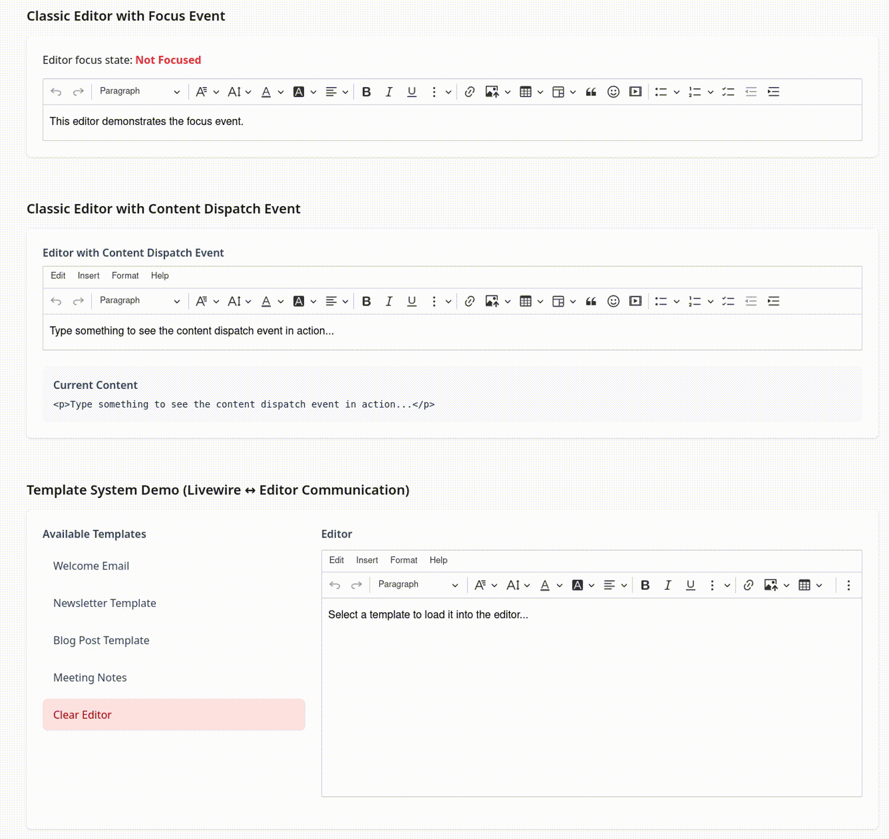

# ckeditor5-livewire

[](LICENSE)
[](http://makeapullrequest.com)

[](https://github.com/Mati365/ckeditor5-livewire/issues)
[](https://app.codecov.io/gh/Mati365/ckeditor5-livewire/tree/main/npm_package%2Fsrc)
[](https://app.codecov.io/gh/Mati365/ckeditor5-livewire/tree/main/src)


CKEditor 5 for Livewire — a lightweight WYSIWYG editor integration for Laravel. It works with Livewire components and standard Blade forms. Easy to set up, it supports custom builds, dynamic loading, and localization. The package includes JavaScript hooks, reusable components, and options for customization, and is suitable for both open-source and commercial projects.

> [!IMPORTANT]
> This integration is unofficial and not maintained by CKSource. For official CKEditor 5 documentation, visit [ckeditor.com](https://ckeditor.com/docs/ckeditor5/latest/). If you encounter any issues in editor, please report them on the [GitHub repository](https://github.com/ckeditor/ckeditor5/issues).

<p align="center">
  
</p>

## Table of Contents

- [ckeditor5-livewire](#ckeditor5-livewire)
  - [Table of Contents](#table-of-contents)
  - [Installation 🚀](#installation-)
    - [🏠 Self-hosted via NPM](#-self-hosted-via-npm)
    - [📡 CDN Distribution](#-cdn-distribution)
  - [Basic Usage 🏁](#basic-usage-)
    - [Simple Editor ✏️](#simple-editor-️)
  - [Configuration ⚙️](#configuration-️)
    - [Override default preset configuration 🧑‍💻](#override-default-preset-configuration-)
    - [Define your configuration directly in the view 💻](#define-your-configuration-directly-in-the-view-)
    - [Define reusable configuration presets 🧩](#define-reusable-configuration-presets-)
    - [Dynamic presets 🎯](#dynamic-presets-)
  - [Providing the License Key 🗝️](#providing-the-license-key-️)
  - [Localization 🌍](#localization-)
    - [CDN Translation Loading 🌐](#cdn-translation-loading-)
    - [Global Translation Config 🛠️](#global-translation-config-️)
    - [Custom translations 🌐](#custom-translations-)
  - [Editor Types 🖊️](#editor-types-️)
    - [Classic editor 📝](#classic-editor-)
    - [Inline editor 📝](#inline-editor-)
    - [Decoupled editor 🌐](#decoupled-editor-)
    - [Multiroot editor 🌳](#multiroot-editor-)
  - [Advanced configuration ⚙️](#advanced-configuration-️)
    - [Livewire Sync 🔄](#livewire-sync-)
      - [Two way binding using `wire:model` ⛓️](#two-way-binding-using-wiremodel-️)
      - [Bidirectional Communication using Events 🔄](#bidirectional-communication-using-events-)
        - [Editor → Livewire: Content Change Event 📤](#editor--livewire-content-change-event-)
        - [Livewire → Editor: Set Content Event 📥](#livewire--editor-set-content-event-)
    - [Focus Tracking 👁️](#focus-tracking-️)
    - [Watchdog 🐶](#watchdog-)
      - [How it works ⚙️](#how-it-works-️)
      - [Disabling the watchdog 🚫](#disabling-the-watchdog-)
  - [Context 🤝](#context-)
    - [Basic usage 🔧](#basic-usage--1)
    - [Custom context translations 🌐](#custom-context-translations-)
  - [Custom plugins 🧩](#custom-plugins-)
  - [Development ⚙️](#development-️)
    - [Running Tests 🧪](#running-tests-)
  - [Psst... 👀](#psst-)
  - [Trademarks 📜](#trademarks-)
  - [License 📜](#license-)

## Installation 🚀

Choose between two installation methods based on your needs. Both approaches provide the same functionality but differ in how CKEditor 5 assets are loaded and managed.

### 🏠 Self-hosted via NPM

Bundle CKEditor 5 with your application for full control over assets, custom builds, and offline support. This method is recommended for advanced users or production applications with specific requirements.

**Complete setup:**

1. **Add PHP dependency** to your `composer.json`:

   ```bash
   composer require mati365/ckeditor5-livewire
   ```

2. **Install CKEditor 5 via NPM:**

   ```bash
   npm install ckeditor5 ckeditor5-premium-features ckeditor5-livewire
   ```

   **Note:** If you use `esbuild` as your bundler, the `ckeditor5-premium-features` may be not required. However, it is needed for `vite` as it has stricter verification of dependencies. Even if you don't use any premium features, the package depends on it and you can safely install it on free or open-source licenses.

3. **Import integration** in your `resources/js/app.js`:

   ```javascript
   import 'ckeditor5-livewire';
   ```

4. **Import styles** in your `resources/css/app.css`:

   ```css
   @import "ckeditor5/ckeditor5.css";
   ```

5. **Use in Blade templates** (no CDN assets needed):

   ```blade
   <livewire:ckeditor5 content="<p>Hello world!</p>" />
   ```

### 📡 CDN Distribution

Load CKEditor 5 directly from CKSource's CDN - no build configuration required. This method is ideal for most users who want quick setup and don't need custom builds.

**Complete setup:**

1. **Add PHP dependency** to your `composer.json`:

   ```bash
   composer require mati365/ckeditor5-livewire
   ```

2. **Install NPM package:**

   ```bash
   npm install ckeditor5-livewire
   ```

3. **Import integration** in your `resources/js/app.js`:

   ```javascript
   import 'ckeditor5-livewire';
   ```

4. **Exclude CKEditor from bundler** in your `vite.config.js`:

   ```javascript
   import { viteCKEditorExternalize } from 'ckeditor5-livewire/bundler/vite-ckeditor5-externalize';
   import laravel from 'laravel-vite-plugin';
   import { defineConfig } from 'vite';

   export default defineConfig({
     plugins: [
       laravel({
         input: ['resources/css/app.css', 'resources/js/app.js'],
         refresh: true,
       }),
       viteCKEditorExternalize()
     ],
   });
   ```

5. **Add license key** (see [Providing the License Key 🗝️](#providing-the-license-key-️) section)

6. **Use in Blade templates:**

   ```blade
   <!-- Load CDN assets in <head> (based on `default` preset) -->
   <x-ckeditor5-assets />

   <!-- or with specific features (overrides `default` preset) -->
   <x-ckeditor5-assets
       preset="default"
       editorVersion="43.0.0"
       :translations="['pl', 'de']"
       ckboxVersion="2.6.0"
       ckboxTheme="lark"
       nonce="csp-nonce"
       premium
   />

   <!-- Use editor anywhere in <body> -->
   <livewire:ckeditor5 content="<p>Hello world!</p>" />
   ```

That's it! 🎉

## Basic Usage 🏁

Get started with the most common usage patterns. These examples show how to render editors in your templates and handle real-time content changes.

### Simple Editor ✏️

Create a basic editor with default toolbar and features. Perfect for simple content editing without server synchronization.

```blade
<!-- CDN only: Load assets in <head> -->
<x-ckeditor5-assets />

<!-- Render editor with initial content -->
<livewire:ckeditor5
    content="<p>Initial content</p>"
    editableHeight="300px"
/>

<!-- You can also use Livewire model binding for real-time sync -->
<livewire:ckeditor5 wire:model.live="content" />
```

## Configuration ⚙️

You can configure the editor _presets_ in your `config/ckeditor5.php` file. The default preset is `default`, which provides a basic configuration with a toolbar and essential plugins. The preset is an array that contains the editor configuration, including the toolbar items and plugins. There can be multiple presets, and you can switch between them by passing the `preset` attribute to the component.

### Override default preset configuration 🧑‍💻

You can pass initial content and merge additional configuration. In scenario below, the `mergeConfig` will extend the `default` preset configuration to make the menu bar visible. It's only shallow merge, so nested arrays will be replaced, not merged.

```blade
<livewire:ckeditor5
    content='<p>This is the initial content of the editor.</p>'
    :mergeConfig="[
        'menuBar' => [
            'isVisible' => true
        ]
    ]"
/>
```

### Define your configuration directly in the view 💻

Override the default configuration with custom plugins and toolbar items. In this example, the editor will only have `Essentials`, `Paragraph`, `Bold`, `Italic`, `Link`, and `Undo` plugins, and the toolbar will contain only bold, italic, link, undo, and redo buttons. The editor locale is set to Polish (`pl`), and a custom translation for the "Bold" label is provided.

```blade
<livewire:ckeditor5
    locale="pl"
    content="<p>This editor has a custom configuration.</p>"
    :customTranslations="[
        'pl' => [
            'Bold' => 'Grubo'
        ]
    ]"
    :config="[
        'plugins' => [
            'Essentials',
            'Paragraph',
            'Bold',
            'Italic',
            'Link',
            'Undo'
        ],
        'toolbar' => [
            'items' => [
                'bold',
                'italic',
                'link',
                'undo',
                'redo'
            ]
        ]
    ]"
/>
```

### Define reusable configuration presets 🧩

In order to override the default preset or add custom presets, publish the configuration file:

```bash
php artisan vendor:publish --tag=ckeditor5-config
```

Then modify `config/ckeditor5.php`:

```php
<?php

return [
    'presets' => [
        'minimal' => [
            'cloud' => [
                'editorVersion' => '47.0.0',
                'premium' => true,
                'translations' => ['pl'],
                'ckbox' => [
                    'version' => '1.0.0'
                ]
            ],
            'config' => [
                'toolbar' => [
                    'items' => ['bold', 'italic', 'link']
                ],
                'plugins' => [
                    'Bold',
                    'Italic',
                    'Link',
                    'Essentials',
                    'Paragraph'
                ]
            ]
        ],
        'full' => [
            'config' => [
                'toolbar' => [
                    'items' => [
                        'heading',
                        '|',
                        'bold',
                        'italic',
                        'underline',
                        '|',
                        'link',
                        'insertImage',
                        'insertTable',
                        '|',
                        'bulletedList',
                        'numberedList',
                        'blockQuote'
                    ]
                ],
                'plugins' => [
                    'Heading',
                    'Bold',
                    'Italic',
                    'Underline',
                    'Link',
                    'ImageBlock',
                    'ImageUpload',
                    'Table',
                    'List',
                    'BlockQuote',
                    'Essentials',
                    'Paragraph'
                ]
            ]
        ]
    ]
];
```

You can use these presets by passing the `preset` attribute to the `<livewire:ckeditor5>` component.

```blade
<livewire:ckeditor5 preset="minimal" content="<p>Simple editor</p>" />
```

### Dynamic presets 🎯

You can also create dynamic presets that can be modified at runtime. This is useful if you want to change the editor configuration based on user input or other conditions.

```php
use CKEditor5\Livewire\Preset\PresetParser;

class Editor extends Component
{
    public array $preset;

    public function mount()
    {
        $this->preset = PresetParser::parse([
            'config' => [
                'toolbar' => [
                    'items' => ['bold', 'italic', 'link']
                ],
                'plugins' => [
                    'Bold',
                    'Italic',
                    'Link',
                    'Essentials',
                    'Paragraph'
                ]
            ]
        ]);
    }
}
```

You can then pass the dynamic preset to the component:

```blade
<livewire:ckeditor5 :preset="$preset" />
```

## Providing the License Key 🗝️

CKEditor 5 requires a license key when using the official CDN or premium features. You can provide the license key in two simple ways:

1. **Environment variable**: Set the `CKEDITOR5_LICENSE_KEY` environment variable in your `.env` file:

   ```env
   CKEDITOR5_LICENSE_KEY=your-license-key-here
   ```

2. **Preset config**: You can also set the license key directly in your preset configuration in `config/ckeditor5.php`:

   ```php
   'presets' => [
       'default' => [
           'licenseKey' => 'your-license-key-here'
       ]
   ]
   ```

If you use CKEditor 5 under the GPL license, you do not need to provide a license key. However, if you choose to set one, it must be set to `GPL`.

If both are set, the preset config takes priority. For more details, see the [CKEditor 5 licensing guide](https://ckeditor.com/docs/ckeditor5/latest/getting-started/licensing/license-and-legal.html).

## Localization 🌍

Support multiple languages in the editor UI and content. Learn how to load translations via CDN or configure them globally.

### CDN Translation Loading 🌐

Depending on your setup, you can preload translations via CDN or let your bundler handle them automatically using lazy imports.

```blade
<!-- CDN only: Load specific translations -->
<x-ckeditor5-assets :translations="['pl', 'de', 'fr']" />

<livewire:ckeditor5
    locale="pl"
    content="<p>Content with Polish UI</p>"
/>
```

### Global Translation Config 🛠️

You can also configure translations globally in your `config/ckeditor5.php` file. This is useful if you want to load translations for multiple languages at once or set a default language for the editor. Keep in mind that this configuration is only used when loading translations via CDN. If you are using self-hosted setup, translations are handled by your bundler automatically.

```php
// config/ckeditor5.php
return [
    'presets' => [
        'default' => [
            'cloud' => [
                'translations' => ['pl', 'de', 'fr']  // CDN only
            ]
        ]
    ]
];
```

**Note:** For self-hosted setups, translations are handled by your bundler automatically.

### Custom translations 🌐

You can also provide custom translations for the editor. This is useful if you want to override existing translations or add new ones. Custom translations can be provided in the preset configuration.

```php
// config/ckeditor5.php
return [
    'presets' => [
        'default' => [
            'customTranslations' => [
                'en' => [
                    'Bold' => 'Custom Bold',
                    'Italic' => 'Custom Italic'
                ],
                'pl' => [
                    'Bold' => 'Grubo',
                    'Italic' => 'Kursywa'
                ]
            ]
        ]
    ]
];
```

## Editor Types 🖊️

CKEditor 5 for Livewire supports multiple distinct editor types, each designed for specific use cases. Choose the one that best fits your application's layout and functionality requirements.

### Classic editor 📝

Traditional WYSIWYG editor with a fixed toolbar above the editing area. Best for standard content editing scenarios like blog posts, articles, or forms.


```blade
<!-- CDN assets in <head> -->
<x-ckeditor5-assets />

<!-- Classic editor in <body> -->
<livewire:ckeditor5
    editorType="classic"
    content="<p>Initial content here</p>"
    editableHeight="300px"
/>
```

### Inline editor 📝

Minimalist editor that appears directly within content when clicked. Ideal for in-place editing scenarios where the editing interface should be invisible until needed.


```blade
<!-- CDN assets in <head> -->
<x-ckeditor5-assets />

<!-- Inline editor -->
<livewire:ckeditor5
    editorType="inline"
    content="<p>Click here to edit this content</p>"
    editableHeight="300px"
/>
```

**Note:** Inline editors don't work with `<textarea>` elements and may not be suitable for traditional form scenarios.

### Decoupled editor 🌐

Flexible editor where toolbar and editing area are completely separated. Provides maximum layout control for custom interfaces and complex applications.


```blade
<!-- CDN assets in <head> -->
<x-ckeditor5-assets />

<!-- Editor instance -->
<livewire:ckeditor5
    editorId="decoupled-editor"
    editorType="decoupled"
    :content="['main' => '<p>This is the initial content of the decoupled editor.</p>']"
/>

<!-- Separate toolbar -->
<livewire:ckeditor5-ui-part
    name="toolbar"
    editorId="decoupled-editor"
    class="my-4"
/>

<!-- Separate editable area -->
<livewire:ckeditor5-editable
    editorId="decoupled-editor"
    class="border border-gray-300 rounded-xs"
    editableClass="p-4"
    content="<p>This is the initial content of the decoupled editor editable.</p>"
/>
```

### Multiroot editor 🌳

Advanced editor supporting multiple separate editing areas (roots) with a shared toolbar. Perfect for complex documents with multiple editable sections like headers, sidebars, and main content.


```blade
<!-- CDN assets in <head> -->
<x-ckeditor5-assets />

<!-- Editor instance with multiple roots -->
<livewire:ckeditor5
    editorId="multiroot-editor"
    editorType="multiroot"
    :content="[
        'header' => '<h1>Document Header</h1>',
        'content' => '<p>Main document content goes here.</p>',
        'footer' => '<p>Document footer</p>'
    ]"
/>

<!-- Shared toolbar -->
<livewire:ckeditor5-ui-part
    name="toolbar"
    editorId="multiroot-editor"
    class="mb-4"
/>

<!-- Header root -->
<livewire:ckeditor5-editable
    editorId="multiroot-editor"
    rootName="header"
    class="mb-4 border border-gray-300 rounded"
    editableClass="p-4"
/>

<!-- Main content root -->
<livewire:ckeditor5-editable
    editorId="multiroot-editor"
    rootName="content"
    class="mb-4 border border-gray-300 rounded"
    editableClass="p-4"
/>

<!-- Footer root -->
<livewire:ckeditor5-editable
    editorId="multiroot-editor"
    rootName="footer"
    class="border border-gray-300 rounded"
    editableClass="p-4"
/>
```

## Advanced configuration ⚙️

### Livewire Sync 🔄

Enable real-time synchronization between the editor and your Livewire component. Content changes are automatically sent to the server with configurable debouncing for performance optimization.



#### Two way binding using `wire:model` ⛓️

Bind the editor content to a Livewire property with optional debounce to control update frequency. This is useful for reducing server load during rapid content changes.

```blade
<livewire:ckeditor5
    wire:model.live="content"
    :saveDebounceMs="500"
/>
```

Handle content changes in your Livewire component:

```php
class Editor extends Component
{
    public $content = [ 'content' => '<p>Initial content</p>' ];

    public function render()
    {
        return view('livewire.editor');
    }

    public function resetContent()
    {
        $this->content = ['content' => ''];
    }
}
```

#### Bidirectional Communication using Events 🔄

The package provides bidirectional communication between Livewire and the editor through custom events.

##### Editor → Livewire: Content Change Event 📤

The editor automatically dispatches the `editor-content-changed` event whenever the content is modified.

```php
namespace App\Livewire;

use Livewire\Component;
use Livewire\Attributes\On;

class ContentMonitor extends Component
{
    public array $content = ['main' => '<p>Initial content</p>'];
    public string $editorId = 'my-editor';

    #[On('editor-content-changed')]
    public function onEditorContentChanged(string $editorId, array $content): void
    {
        if ($editorId === $this->editorId) {
            $this->content = $content;
            // Your custom logic here
        }
    }

    public function render()
    {
        return view('livewire.content-monitor');
    }
}
```

##### Livewire → Editor: Set Content Event 📥

Update the editor content from your Livewire component by dispatching the `set-editor-content` event.

```php
namespace App\Livewire;

use Livewire\Component;

class EditorDemo extends Component
{
    public string $editorId = 'my-editor';

    public function loadContent(): void
    {
        $this->dispatch(
            'set-editor-content',
            editorId: $this->editorId,
            content: ['main' => '<p>New content loaded!</p>']
        );
    }

    public function render()
    {
        return view('livewire.editor-demo');
    }
}
```

```blade
<!-- resources/views/livewire/editor-demo.blade.php -->
<div>
    <button wire:click="loadContent">Load Content</button>

    <livewire:ckeditor5 :editorId="$editorId" />
</div>
```

> [!IMPORTANT]
> Do not use `wire:model` together with these events on the same editor instance, as the broadcasted value might be overwritten by Livewire's internal synchronization.

### Focus Tracking 👁️

You can track the focus and blur events of the editor by listening for the `editor-focus-changed` event. This event is dispatched with the editor ID and a boolean indicating whether the editor is focused.

```php
// app/Livewire/FocusDemo.php
namespace App\Livewire;

use Livewire\Component;
use Livewire\Attributes\On;

class FocusDemo extends Component
{
    public bool $isFocused = false;
    public string $editorId = 'focus-demo-editor';

    #[On('editor-focus-changed')]
    public function onEditorFocusChanged(string $editorId, bool $focused): void
    {
        if ($editorId === $this->editorId) {
            $this->isFocused = $focused;
        }
    }

    public function render()
    {
        return view('livewire.focus-demo');
    }
}
```

```blade
<!-- resources/views/livewire/focus-demo.blade.php -->
<div>
    <p class="mb-4">
        Editor focus state:
        <span class="font-bold {{ $isFocused ? 'text-green-500' : 'text-red-500' }}">
            {{ $isFocused ? 'Focused' : 'Not Focused' }}
        </span>
    </p>

    <livewire:ckeditor5
        :editorId="$editorId"
        content='<p>This editor demonstrates the focus event.</p>'
    />
</div>
```

### Watchdog 🐶

By default, the `<livewire:ckeditor5>` component uses a built-in watchdog mechanism to automatically restart the editor if it crashes (e.g., due to a JavaScript error). The watchdog periodically saves the editor's content and restores it after a crash, minimizing the risk of data loss for users.

#### How it works ⚙️

- If the editor crashes, it is automatically restarted without requiring a page reload.
- The editor's content is periodically saved in the browser's memory.
- After a restart, the last saved content is automatically restored.

This feature is especially useful in applications where reliability and data safety are important.

#### Disabling the watchdog 🚫

The watchdog is enabled by default. To disable it, set the `watchdog` attribute to `false`:

```blade
<livewire:ckeditor5
    content="<p>Initial content</p>"
    :watchdog="false"
/>
```

## Context 🤝

The **context** feature is designed to group multiple editor instances together, allowing them to share a common context. This is particularly useful in collaborative editing scenarios, where users can work together in real time. By sharing a context, editors can synchronize features such as comments, track changes, and presence indicators across different editor instances. This enables seamless collaboration and advanced workflows in your Phoenix application.

For more information about the context feature, see the [CKEditor 5 Context documentation](https://ckeditor.com/docs/ckeditor5/latest/features/collaboration/context-and-collaboration-features.html).


### Basic usage 🔧

Define your context in configuration (`config/ckeditor5.php`):

```php
return [
    'contexts' => [
        'my-context' => [
            'config' => [
                'plugins' => [
                    'CustomContextPlugin'
                ]
            ],
            'watchdogConfig' => [
                'crashNumberLimit' => 20
            ]
        ]
    ],
    'presets' => [
        // ...
    ]
];
```

And use it in your Blade template:

```blade
<!-- Create a context -->
<livewire:ckeditor5-context contextId="my-context" />

<!-- Editor 1 using the context -->
<livewire:ckeditor5
    contextId="my-context"
    content="Content 1"
/>

<!-- Editor 2 using the same context -->
<livewire:ckeditor5
    class="mt-6"
    contextId="my-context"
    content="Content 2"
/>
```

### Custom context translations 🌐

Define your custom translations in the configuration:

```php
return [
    'contexts' => [
        'custom' => [
            // ...
            'customTranslations' => [
                'en' => [
                    'Bold' => 'Custom Bold',
                    'Italic' => 'Custom Italic'
                ],
                'pl' => [
                    'Bold' => 'Pogrubiony',
                    'Italic' => 'Kursywa'
                ]
            ]
        ]
    ]
];
```

These translations will be used in the context's editors, overriding the default translations.

## Custom plugins 🧩

To register a custom plugin, use the `registerCustomEditorPlugin` function. This function takes the plugin name and the plugin _reader_ that returns a class extending `Plugin`.

```javascript
import { CustomEditorPluginsRegistry as Registry } from 'ckeditor5-livewire';

const unregister = Registry.the.register('MyCustomPlugin', async () => {
  // It's recommended to use lazy import to
  // avoid bundling ckeditor code in your application bundle.
  const { Plugin } = await import('ckeditor5');

  return class extends Plugin {
    static get pluginName() {
      return 'MyCustomPlugin';
    }

    init() {
      console.log('MyCustomPlugin initialized');
      // Custom plugin logic here
    }
  };
});
```

In order to use the plugin you need to extend your config in `config/config.php`:

```php
'presets' => [
    'default' => [
        'config' => [
            'plugins' => [
                'MyCustomPlugin',
                // other plugins...
            ],
            'toolbar' => [
                'items' => [
                    'myCustomButton',
                    // other toolbar items...
                ]
            ]
        ]
    ]
];
```

It must be called before the editor is initialized. You can unregister the plugin later by calling the returned function:

```javascript
unregister();
// or CustomEditorPluginsRegistry.the.unregister('MyCustomPlugin');
```

If you want to de-register all registered plugins, you can use the `unregisterAll` method:

```javascript
import { CustomEditorPluginsRegistry } from 'ckeditor5-livewire';

CustomEditorPluginsRegistry.the.unregisterAll();
```

## Editors & contexts registry 👀

The package provides two registries: `EditorsRegistry` and `ContextsRegistry`. They allow you to watch for changes in registered editors and contexts, get instances directly, or execute logic when a specific editor or context appears.

- **`watch(callback)`** — react whenever registry state changes.

```javascript
import { EditorsRegistry } from 'ckeditor5-livewire';

const unregisterWatcher = EditorsRegistry.the.watch((editors) => {
  console.log('Registered editors changed:', editors);
});

// Later, you can unregister the watcher
unregisterWatcher();
```

- **`waitFor(id)`** — get the instance directly. If it is already registered, the promise resolves immediately.

```javascript
import { EditorsRegistry } from 'ckeditor5-livewire';

EditorsRegistry.the.waitFor('editor1').then((editor) => {
  console.log('Editor "editor1" is registered:', editor);
});

// ... init editor somewhere later
```

- **`execute(id, callback)`** — run logic immediately if the instance already exists, or later when it appears.

```javascript
import { EditorsRegistry } from 'ckeditor5-livewire';

EditorsRegistry.the.execute('editor1', (editor) => {
  console.log('Current data:', editor.getData());
});
```

- The same methods are available on `ContextsRegistry` for shared contexts:

```javascript
import { ContextsRegistry } from 'ckeditor5-livewire';

ContextsRegistry.the.waitFor('shared-context').then((watchdog) => {
  console.log('Context is ready:', watchdog.context);
});

ContextsRegistry.the.execute('shared-context', (watchdog) => {
  console.log('Context state:', watchdog.state);
});
```

## Development ⚙️

To start the development environment, run:

```bash
pnpm run dev
```

The playground app will be available at [http://localhost:8000](http://localhost:8000).

### Running Tests 🧪

The project includes comprehensive PHP unit tests with 100% code coverage requirement:

```bash
# Run all tests
composer test

# Run tests with coverage report (requires pcov)
composer test:coverage
```

## Psst... 👀

If you're looking for similar stuff, check these out:

- [ckeditor5-phoenix](https://github.com/Mati365/ckeditor5-phoenix)
  Seamless CKEditor 5 integration for Phoenix Framework. Plug & play support for LiveView forms with dynamic content, localization, and custom builds.

- [ckeditor5-rails](https://github.com/Mati365/ckeditor5-rails)
  Smooth CKEditor 5 integration for Ruby on Rails. Works with standard forms, Turbo, and Hotwire. Easy setup, custom builds, and localization support.

- [ckeditor5-symfony](https://github.com/Mati365/ckeditor5-symfony)
  Native CKEditor 5 integration for Symfony. Works with Symfony 6.x+, standard forms and Twig. Supports custom builds, multiple editor configurations, asset management, and localization. Designed to be simple, predictable, and framework-native.

## Trademarks 📜

CKEditor® is a trademark of [CKSource Holding sp. z o.o.](https://cksource.com/) All rights reserved. For more information about the license of CKEditor® please visit [CKEditor's licensing page](https://ckeditor.com/legal/ckeditor-oss-license/).

This package is not owned by CKSource and does not use the CKEditor® trademark for commercial purposes. It should not be associated with or considered an official CKSource product.

## License 📜

This project is licensed under the terms of the [MIT LICENSE](LICENSE).

This project injects CKEditor 5 which is licensed under the terms of [GNU General Public License Version 2 or later](https://www.gnu.org/licenses/old-licenses/gpl-2.0.html). For more information about CKEditor 5 licensing, please see their [official documentation](https://ckeditor.com/legal/ckeditor-oss-license/).
