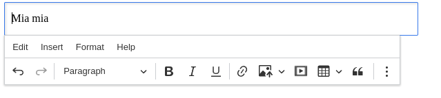

# ckeditor5-livewire

[](LICENSE)
[](http://makeapullrequest.com)

[](https://github.com/Mati365/ckeditor5-livewire/issues)
[](https://app.codecov.io/gh/Mati365/ckeditor5-livewire/tree/main/npm_package%2Fsrc)
[](https://app.codecov.io/gh/Mati365/ckeditor5-livewire/tree/main/src)

CKEditor 5 for Livewire — a lightweight WYSIWYG editor integration for Laravel. It works with Livewire components and standard Blade forms. Easy to set up, it supports custom builds, dynamic loading, and localization. The package includes JavaScript hooks, reusable components, and options for customization, and is suitable for both open-source and commercial projects.

> [!IMPORTANT]
> This integration is unofficial and not maintained by CKSource. For official CKEditor 5 documentation, visit [ckeditor.com](https://ckeditor.com/docs/ckeditor5/latest/). If you encounter any issues in editor, please report them on the [GitHub repository](https://github.com/ckeditor/ckeditor5/issues).

<p align="center">
  
</p>

## Under Construction 🚧

This project is still in development and not production-ready. Features, structure, and APIs may change.

## Usage example ✍️

Below is a minimal Blade example showing what to add to the page `<head>` and to the `<body>` in order to render the editor powered by Livewire. The example is based on `playground/resources/views/home.blade.php` from this repository.

### What to add to the head 🔗

In the page head you should load the CKEditor 5 assets and Livewire scripts. If you're using Vite, include your app CSS and JS as well.

Example:

```blade
<!-- CKEditor 5 Assets -->
<x-ckeditor5-assets />

<!-- Livewire scripts -->
@livewireScripts

<!-- If you use Vite / built assets -->
@if (file_exists(public_path('build/manifest.json')) || file_exists(public_path('hot')))
  @vite(['resources/css/app.css', 'resources/js/app.js'])
@endif
```

### What to add to the page body 🧩

Place the Livewire component where you want the editor to appear. This example shows basic options: the field name (`name`), CSS class and initial content passed as an array.

Example:

```blade
<livewire:ckeditor5 />
```

### Vite / import configuration ⚙️🔌

Add lines below to your Vite app entrypoint so the package's JS hooks and Livewire wiring are included in your app. The `ckeditor5-livewire` package provides the integration (not the editor build itself) and is needed whether you use the cloud distribution or a self-hosted build from NPM.

```js
// playground/resources/js/app.ts
import 'ckeditor5-livewire';
```

Cloud distribution vs self-hosted (NPM):

- Cloud distribution (hosted by CKEditor) is useful if you don't want to install a build. In that case include the cloud script in the `<head>` using the assets/component described above. If you install the editor via NPM (self-hosted), the cloud script is not required and should be omitted from the head to avoid duplicate loading.

- If you rely on the cloud-hosted script (for example when loading CKEditor from a CDN or via an import map) but still build your app with Vite, add `vite-plugin-externalize-dependencies` to your Vite config so Vite doesn't bundle CKEditor into your application and the editor is loaded from the external source instead.

Example `vite.config.js` snippet (playground) showing `externalize` usage:

```js
import externalize from 'vite-plugin-externalize-dependencies';

export default defineConfig({
  plugins: [
    // other plugins...
    externalize({
      // externalize cloud distribution or CKEditor packages so they are loaded from CDN
      externals: ['ckeditor5', 'ckeditor5-premium-features'],
    }),
  ],
});
```

If you rely on the cloud-hosted script (not installed via NPM), keep the `<x-ckeditor5-assets />` in the head so the editor script is available globally.

## Advanced configuration ⚙️

### Basic editor with custom content and merged config 🧑‍💻

You can pass initial content and merge additional configuration. In scenario below, the `mergeConfig` will extend the `default` preset configuration to make the menu bar visible. It's only shallow merge, so nested arrays will be replaced, not merged.

```blade
<livewire:ckeditor5
    content='<p>This is the initial content of the editor.</p>'
    :mergeConfig="[
        'menuBar' => [
            'isVisible' => true
        ]
    ]"
/>
```

### Custom configuration with plugins and toolbar items ⚙️

Override the default configuration with custom plugins and toolbar items. In this example, the editor will only have `Essentials`, `Paragraph`, `Bold`, `Italic`, `Link`, and `Undo` plugins, and the toolbar will contain only bold, italic, link, undo, and redo buttons. The editor locale is set to Polish (`pl`), and a custom translation for the "Bold" label is provided.

```blade
<livewire:ckeditor5
    locale="pl"
    content="<p>This editor has a custom configuration.</p>"
    :customTranslations="[
        'pl' => [
            'Bold' => 'Grubo'
        ]
    ]"
    :config="[
        'plugins' => [
            'Essentials',
            'Paragraph',
            'Bold',
            'Italic',
            'Link',
            'Undo'
        ],
        'toolbar' => [
            'items' => [
                'bold',
                'italic',
                'link',
                'undo',
                'redo'
            ]
        ]
    ]"
/>
```

### Context 🤝

The **context** feature is designed to group multiple editor instances together, allowing them to share a common context. This is particularly useful in collaborative editing scenarios, where users can work together in real time. By sharing a context, editors can synchronize features such as comments, track changes, and presence indicators across different editor instances. This enables seamless collaboration and advanced workflows in your Phoenix application.

For more information about the context feature, see the [CKEditor 5 Context documentation](https://ckeditor.com/docs/ckeditor5/latest/features/collaboration/context-and-collaboration-features.html).


```blade
<!-- Create a context -->
<livewire:ckeditor5-context contextId="my-context" />

<!-- Editor 1 using the context -->
<livewire:ckeditor5
    contextId="my-context"
    content="Content 1"
/>

<!-- Editor 2 using the same context -->
<livewire:ckeditor5
    class="mt-6"
    contextId="my-context"
    content="Content 2"
/>
```

### Inline editor 📝

Minimalist editor that appears directly within content when clicked. Ideal for in-place editing scenarios where the editing interface should be invisible until needed.

**Features:**

- No visible toolbar until content is focused
- Seamless integration with existing layouts
- Great for editing headings, captions, or short content



```blade
<%!-- Inline editor --%>
<.ckeditor
  editorType="inline"
  content="<p>Click here to edit this content</p>"
  editableHeight="300px"
/>
```

**Note:** Inline editors don't work with `<textarea>` elements and may not be suitable for traditional form scenarios.

### Decoupled editor 🌐

Flexible editor where toolbar and editing area are completely separated. Provides maximum layout control for custom interfaces and complex applications.

**Features:**

- Complete separation of toolbar and content area
- Custom positioning and styling of UI elements
- Full control over editor layout and appearance


```blade
<!-- Editor instance -->
<livewire:ckeditor5
    editorId="decoupled-editor"
    editorType="decoupled"
    :content="['main' => '<p>This is the initial content of the decoupled editor.</p>']"
/>

<!-- Separate toolbar -->
<livewire:ckeditor5-ui-part
    name="toolbar"
    editorId="decoupled-editor"
    class="my-4"
/>

<!-- Separate editable area -->
<livewire:ckeditor5-editable
    editorId="decoupled-editor"
    class="border border-gray-300 rounded-xs"
    editableClass="p-4"
    content="<p>This is the initial content of the decoupled editor editable.</p>"
/>
```

## Development ⚙️

To start the development environment, run:

```bash
pnpm run dev
```

The playground app will be available at [http://localhost:8000](http://localhost:8000).

### Running Tests 🧪

The project includes comprehensive PHP unit tests with 100% code coverage requirement:

```bash
# Run all tests
composer test

# Run tests with coverage report (requires pcov)
composer test:coverage
```

## Custom plugins 🧩

To register a custom plugin, use the `registerCustomEditorPlugin` function. This function takes the plugin name and the plugin _reader_ that returns a class extending `Plugin`.

```javascript
import { CustomEditorPluginsRegistry as Registry } from 'ckeditor5-livewire';

const unregister = Registry.the.register('MyCustomPlugin', async () => {
  // It's recommended to use lazy import to
  // avoid bundling ckeditor code in your application bundle.
  const { Plugin } = await import('ckeditor5');

  return class extends Plugin {
    static get pluginName() {
      return 'MyCustomPlugin';
    }

    init() {
      console.log('MyCustomPlugin initialized');
      // Custom plugin logic here
    }
  };
});
```

In order to use the plugin you need to extend your config in your `config` file:

```php
'plugins' => [
    // other plugins...
    'MyCustomPlugin',
],
```

It must be called before the editor is initialized. You can unregister the plugin later by calling the returned function:

```javascript
unregister();
// or CustomEditorPluginsRegistry.the.unregister('MyCustomPlugin');
```

If you want to de-register all registered plugins, you can use the `unregisterAll` method:

```javascript
import { CustomEditorPluginsRegistry } from 'ckeditor5-livewire';

CustomEditorPluginsRegistry.the.unregisterAll();
```

## Psst... 👀

If you're looking for similar stuff, check these out:

- [ckeditor5-phoenix](https://github.com/Mati365/ckeditor5-phoenix)
  Seamless CKEditor 5 integration for Phoenix Framework. Plug & play support for LiveView forms with dynamic content, localization, and custom builds.

- [ckeditor5-rails](https://github.com/Mati365/ckeditor5-rails)
  Smooth CKEditor 5 integration for Ruby on Rails. Works with standard forms, Turbo, and Hotwire. Easy setup, custom builds, and localization support.

## Trademarks 📜

CKEditor® is a trademark of [CKSource Holding sp. z o.o.](https://cksource.com/) All rights reserved. For more information about the license of CKEditor® please visit [CKEditor's licensing page](https://ckeditor.com/legal/ckeditor-oss-license/).

This gem is not owned by CKSource and does not use the CKEditor® trademark for commercial purposes. It should not be associated with or considered an official CKSource product.

## License 📜

This project is licensed under the terms of the [MIT LICENSE](LICENSE).
